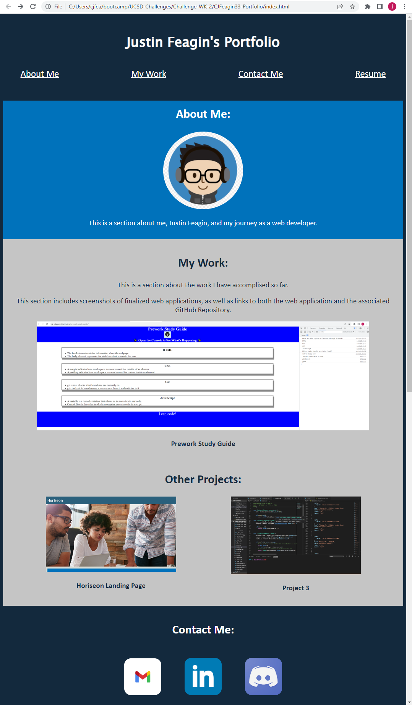

# Justin-Feagin-Portfolio

## Description

This web application serves as a means for me to upload and showcase my completed projects. As of right now, it is showcasing 3 different projects, although this number can be expanded in the future. It also serves as a way for potential employers to be introduced to me, to learn about me, and to reach out in order to contact me.

Throughout this project, I learned the ins and outs of CSS and HTML. There were so many issues I ran into along the way, especially in CSS. But working through these issues in order to achieve a finalized product is what really gave me a deeper knowledge on these languages.

## Instalation

This entire project was made in Visual Studio. I started by creating a repository on GitHub (with a README.md included), then opening the repository in VS. I went on to create a index.html file which contains the skeleton of my website, and then linked it to a style.css stylesheet. After the index.html file was completed, I went on to style the website within the style.css file. 

## Usage

The final product looks like this:

If you click on any of the 4 items in the navigation bar, the website will automatically direct you to that portion of the web app. You can also click on all the images and icons in order to be taken to their corresponding links. The website has also been optimized in order to resize certain elements based of the size of the viewport.

Here is a link to the completed web application: 

https://cjfeagin33.github.io/Justin-Feagin-Portfolio/

## Credit

This application was built with assistance from my peers and instructors within the UCSD Extended Studies Coding Bootcamp.